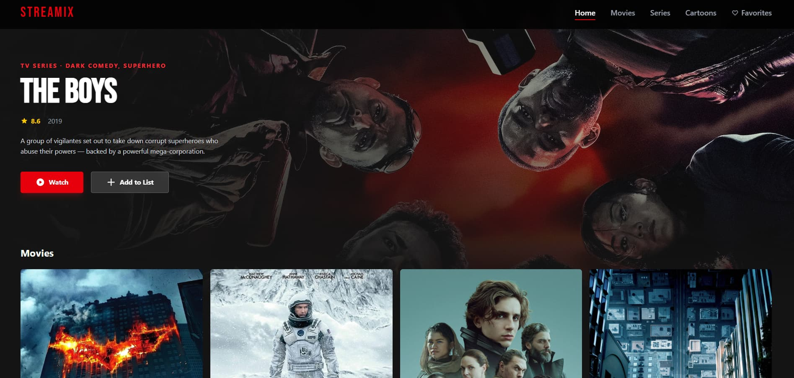

# Streamix

A Netflix-style streaming catalog UI — portfolio project built with React + TS + Vite.



## Tech stack

| Tool | Version |
|------|---------|
| React | 19 |
| React Router | 7 |
| TypeScript | 6 |
| Tailwind CSS | 4 |
| Framer Motion | 12 |
| Vite | 8 |

## Getting started

```bash
npm install
npm run dev
```

Open [http://localhost:5173](http://localhost:5173)

---

## What's done

### Core
- [x] React + Vite project setup with Tailwind CSS v4
- [x] React Router v7 — 6 routes: `/`, `/movies`, `/series`, `/cartoons`, `/favorites`, `/search`
- [x] Full TypeScript migration — discriminated union types (`Movie | Show`), strict mode
- [x] Dark-only theme (`#141414` background, red-600 accent)
- [x] Bebas Neue bold font for logo and headings
- [x] **TMDB API integration** — live data via `/movie/popular`, `/tv/popular`, `/discover/tv`; genre ID maps; normalizer layer

### Components
- [x] **Navbar** — fixed top bar with logo, active-link red underline, responsive mobile drawer
- [x] **Hamburger menu** — animated 3-line → X toggle, slide-in drawer, backdrop, auto-closes on navigation
- [x] **HeroBanner** — full-viewport auto-rotating hero (5s interval), parallax scroll, dual gradient overlays, Watch / Add to Favorites CTAs
- [x] **MovieCard** — poster with hover scale + red glow, type badge, TMDB logo watermark, heart toggle
- [x] **MovieModal** — spring entrance animation, trailer embed fetched live from TMDB, full metadata (director/creator, cast, runtime/seasons, country)
- [x] **SkeletonCard** — pulse skeleton matching card dimensions, used as lazy-load fallback
- [x] **ScrollRow** — Netflix-style horizontal slider with native `scrollBy` arrows, hidden scrollbar, staggered card entrance animation

### Features
- [x] **Favorites** — localStorage persistence, heart toggle on cards and hero banner, empty-state UI
- [x] **Search** — Netflix-style expanding input in navbar (spring animation), 300ms debounce, `/search?q=` route, results sorted by relevance
- [x] **Genre rows** — Home page divided into horizontal genre rows (Drama, Action, Sci-Fi, etc.) built from live TMDB data; each title appears in exactly one row
- [x] **Trailer modal** — YouTube embed fetched from TMDB on modal open; prefers official trailer, falls back to any trailer or teaser
- [x] **Live metadata** — cast, director/creator, runtime/seasons, country fetched from TMDB detail endpoint on modal open
- [x] **Page transitions** — Framer Motion `AnimatePresence` fade between routes
- [x] **Staggered animations** — grid and slider cards animate in with spring on page load
- [x] **Lazy loading** — all pages code-split with `React.lazy` + `Suspense`

---

## What's planned

- [ ] **TMDB-powered search** — replace static filtering with live `/search/multi` results and debounce
- [ ] **Detail page** — dedicated `/movie/:id` and `/tv/:id` routes with full cast, related titles, and trailer
- [ ] **Pagination / infinite scroll** — load more pages from TMDB as the user scrolls each genre row
- [ ] **Genre filter chips** — filter Movies / Series / Cartoons pages by genre tag

---

## Project structure

```
src/
├── types/
│   └── content.ts              # Movie | Show discriminated union
├── api/
│   └── tmdb.ts                 # Fetch helpers, genre maps, normalizers, fetchVideos, fetchDetails
├── hooks/
│   ├── useTMDB.ts              # Generic fetch hook → { items, loading, error }
│   └── useFavorites.tsx        # localStorage sync
├── components/
│   ├── Navbar.tsx              # Top nav + mobile drawer + expanding search
│   ├── MovieCard.tsx           # Poster card with hover effects + favorites
│   ├── MovieModal.tsx          # Detail modal with live trailer + metadata
│   ├── HeroBanner.tsx          # Auto-rotating full-viewport hero
│   ├── ScrollRow.tsx           # Horizontal genre slider with arrow buttons
│   ├── PageWrapper.tsx         # Framer Motion page transition wrapper
│   └── SkeletonCard.tsx        # Pulse skeleton for loading states
├── pages/
│   ├── Home.tsx                # HeroBanner + Netflix-style genre rows
│   ├── Movies.tsx
│   ├── Series.tsx
│   ├── Cartoons.tsx
│   ├── Favorites.tsx
│   └── Search.tsx              # Filtered results from ?q= param
├── context/
│   └── FavoritesContext.tsx
├── data/
│   └── featuredMovies.ts       # Hero banner rotation list (static, curated)
└── utils/
    ├── motionVariants.ts       # Shared Framer Motion variants
    └── groupByGenre.ts         # Groups ContentItem[] by primary genre
```
